# JavaScript ES6, ES7, ES8: Learn to Code on the Bleeding Edge (Full Course) Notes

## Template Literals:
- Template literals are enclosed by the backtick ( `` ) (grave accent) character instead of double or single quotes.

- Template literals can contain placeholders. These are indicated by the dollar sign and curly braces (${expression}). The expressions in the placeholders and the text between the backticks ( `` ) get passed to a function.

- Syntax:

    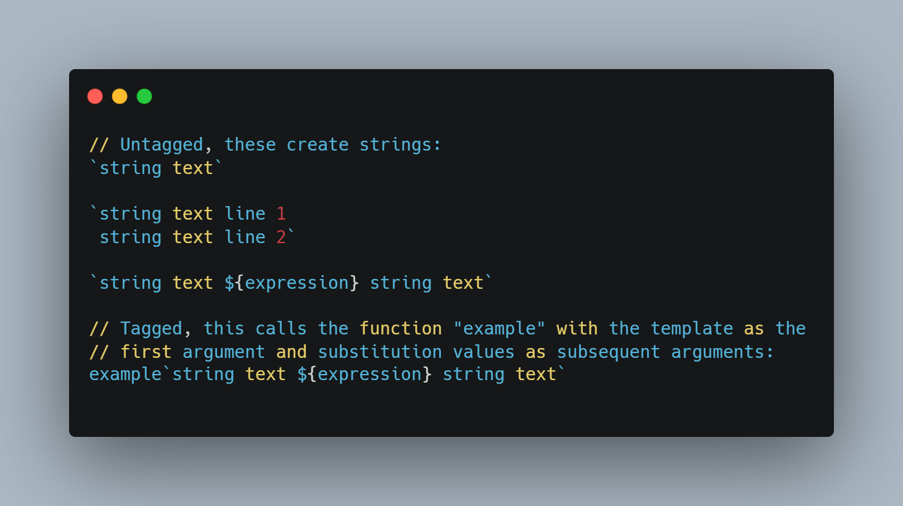


- Example:

    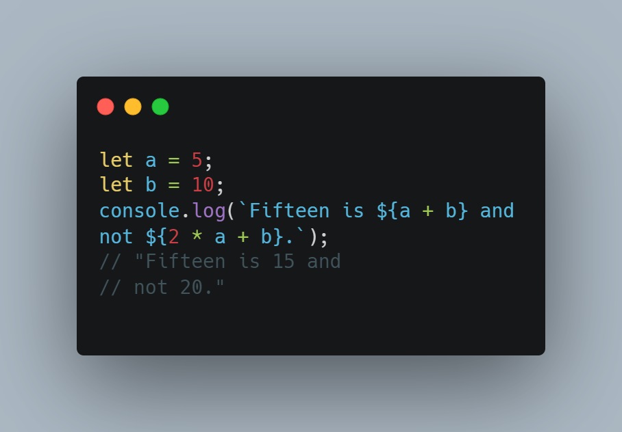


## Destructuring
- The destructuring assignment syntax is a JavaScript expression that makes it possible to unpack values from arrays, or properties from objects, into distinct variables.


### Destructuring objects
- Example:
    ```
    Object:
    const player = {
    name: 'Lebron James',
    club: 'LA Lakers',
    address: {
        city: 'Los Angeles'
    }
    };
    ```
    After destructing:
    ```
    const { name, club, address: { city } } = player;
    ```


### Destructuring arrays

- Example:
    ```
    let [firstName, middleName, lastName] = ['Dylan', 'Coding God', 'Israel'];
    ```
 

## Object Literal
- A JavaScript object literal is a comma-separated list of name-value pairs wrapped in curly braces. Object literals encapsulate data, enclosing it in a tidy package. This minimizes the use of global variables which can cause problems when combining code.

- After destructuring 

    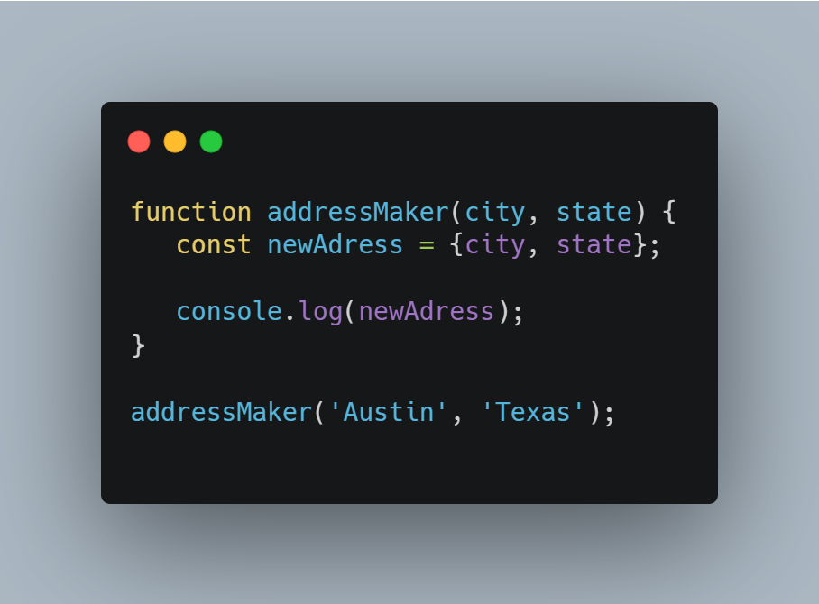

## for of loop
- The for...of statement creates a loop iterating over iterable objects, including: built-in String, Array, array-like objects (e.g., arguments or NodeList), TypedArray, Map, Set, and user-defined iterables. It invokes a custom iteration hook with statements to be executed for the value of each distinct property of the object.

- Syntax:
    ```
    for (variable of iterable) {
    statement
    }
    ```

- Example: 

    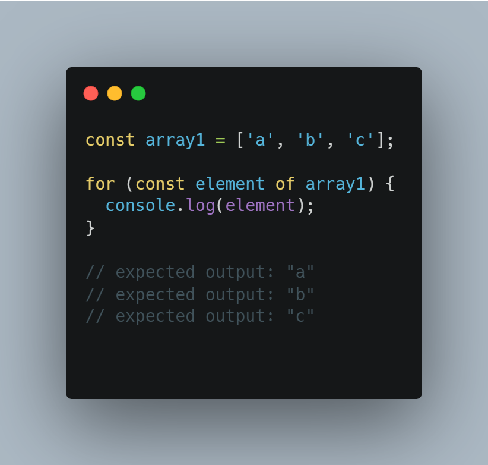


##  Spread Operator
- Spread syntax (...) allows an iterable such as an array expression or string to be expanded in places where zero or more arguments (for function calls) or elements (for array literals) are expected, or an object expression to be expanded in places where zero or more key-value pairs (for object literals) are expected.

***In short Copy*** 

- Example:

    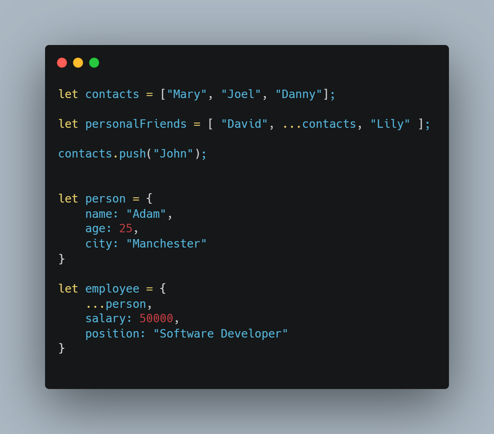


## Rest Operator[es6]
- The rest parameter syntax allows a function to accept an indefinite number of arguments as an array, providing a way to represent variadic functions in JavaScript.
- A function definition's last parameter can be prefixed with "..." , which will cause all remaining (user supplied) parameters to be placed within a standard JavaScript array. Only the last parameter in a function definition can be a rest parameter.

- Syntax:
    ```
    function f(a, b, ...theArgs) {
    // ...
    }

    ```
- Example: 

    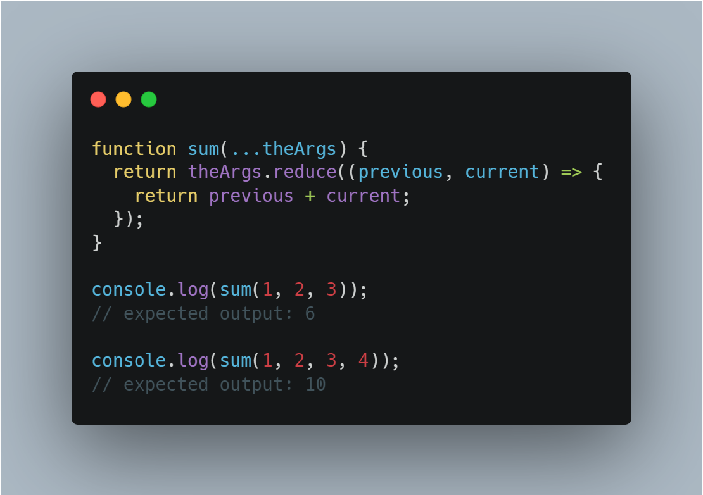


## Arrow Functions
- An arrow function expression is a compact alternative to a traditional function expression, but is limited and can't be used in all situations.
- Example: 

    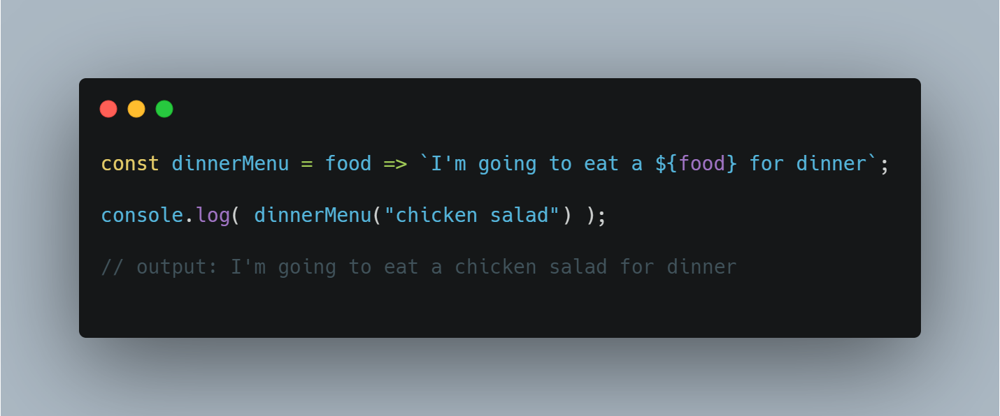


## Default Params
- Default function parameters allow named parameters to be initialized with default values if no value or undefined is passed.

- Example:

    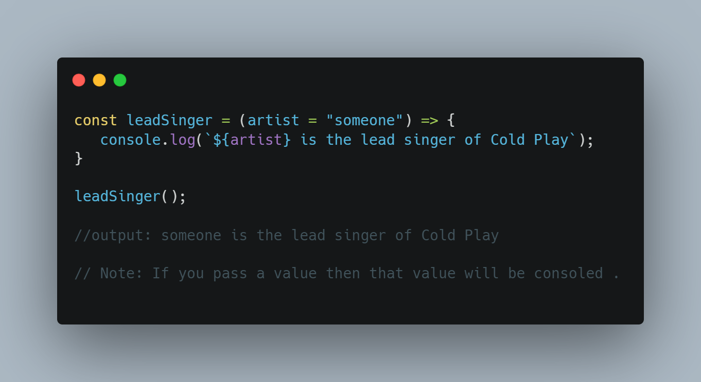


## includes()
- The includes() method determines whether an array includes a certain value among its entries, returning true or false as appropriate.

***Returns a boolean value***

- Syntax:
    ```
    includes(searchElement)
    includes(searchElement, fromIndex)
    ```

- Example: 

    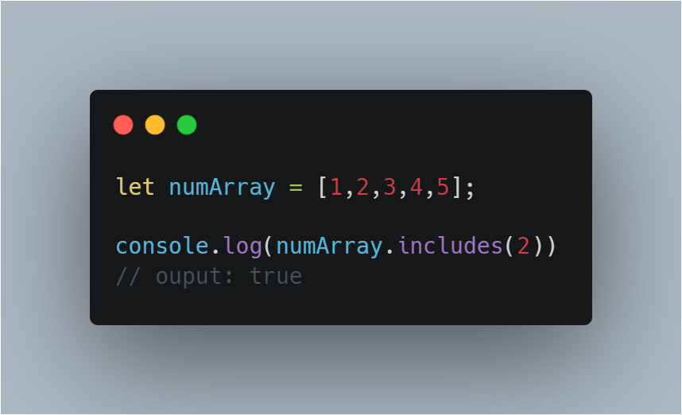


## let and const
- ES6 introduced two important new JavaScript keywords: let and const.
### let
- The let statement declares a block-scoped local variable, optionally initializing it to a value.

### const
- Const are read-only properties
- Constants are block-scoped, much like variables declared using the let keyword. 
- The value of a constant can't be changed through reassignment (i.e. by using the assignment operator), and it can't be redeclared (i.e. through a variable declaration). 
- However, if a constant is an object or array its properties or items can be updated or removed.


## import and export
- Create export in one file 
- Import the function/variable from that file where we have written that export.
- The export statement is used when creating JavaScript modules to export live bindings to functions, objects, or primitive values from the module so they can be used by other programs with the import statement. Exported modules are in strict mode whether you declare them as such or not. The export statement cannot be used in embedded scripts
- The static import statement is used to import read only live bindings which are exported by another module.
Imported modules are in strict mode whether you declare them as such or not. The import statement cannot be used in embedded scripts unless such script has a type="module"
- There is also a function-like dynamic import(), which does not require scripts of type="module".


## padStart() 
- The padStart() method pads the current string with another string (multiple times, if needed) until the resulting string reaches the given length. The padding is applied from the start of the current string.

- Syntax:
    ```
    padStart(targetLength)
    padStart(targetLength, padString)
    ```

- Example:

    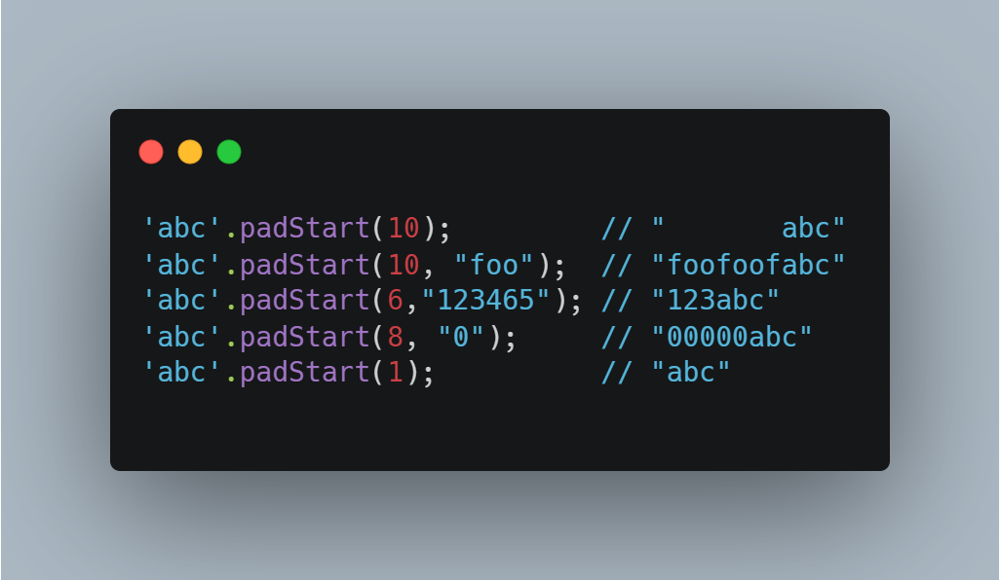


## padEnd()
- The padEnd() method pads the current string with a given string (repeated, if needed) so that the resulting string reaches a given length. The padding is applied from the end of the current string.

- Syntax:
    ```
    padEnd(targetLength)
    padEnd(targetLength, padString)
    ```
- Example:

    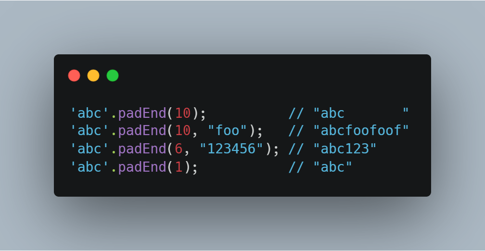


## Classes
- Classes are a template for creating objects. They encapsulate data with code to work on that data. Classes in JS are built on prototypes but also have some syntax and semantics that are not shared with ES5 class-like semantics.

- Constructor: The constructor method is a special method for creating and initializing an object created with a class. There can only be one special method with the name "constructor" in a class. A SyntaxError will be thrown if the class contains more than one occurrence of a constructor method.
- A constructor can use the super keyword to call the constructor of the super class.
Static:The static keyword defines a static method or property for a class, or a class static initialization block (see the link for more information about this usage). Neither static methods nor static properties can be called on instances of the class. Instead, they're called on the class itself.
- Syntax:
    ```
    static methodName() { /* ... */ }
    static propertyName [= value];

    // Class static initialization block
    static {

    }
    ```
- get:  The get syntax binds an object property to a function that will be called when that property is looked up.

- Extends :The extends keyword is used in class declarations or class expressions to create a class as a child of another class.
- Super: The super keyword is used to call corresponding methods of super(parent) class. 


## Trailing commas
- Trailing commas (sometimes called "final commas") can be useful when adding new elements, parameters, or properties to JavaScript code. If you want to add a new property, you can add a new line without modifying the previously last line if that line already uses a trailing comma.
- Syntax:
    ```
    ,

    ```
- Example: 
    ```
    var arr = [1,2,3,];
    arr; // [1, 2, 3]
    arr.length; // 3
    ```


## Promises
- The Promise object represents the eventual completion (or failure) of an asynchronous operation and its resulting value.
- A Promise object is created using the new keyword and its constructor. This constructor takes a function, called the "executor function", as its parameter. 
- This function should take two functions as parameters. 

> Resolve and Reject
- The first of these functions **(resolve)** is called when the asynchronous task completes successfully and returns the results of the task as a value. 
- The second **(reject)** is called when the task fails, and returns the reason for failure, which is typically an error object.

- Two chanin methods (.then().catch())
- Example:

    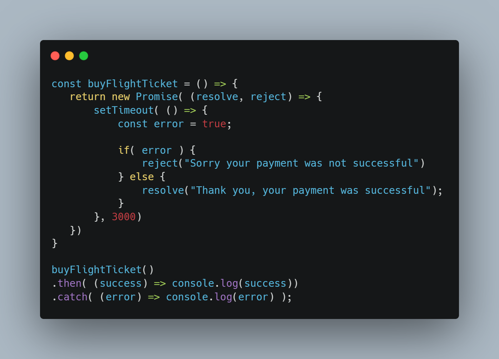


## Fetch
- The Fetch API provides a JavaScript interface for accessing and manipulating parts of the HTTP pipeline, such as requests and responses.
It also provides a global fetch() method that provides an easy, logical way to fetch resources asynchronously across the network.
- Example:
     ```
    fetch('https://jsonplaceholder.typicode.com/comments/1')
        .then(response => response.json())
        .then(data => console.log(data))

    ```
        
## Async and Await
- First of all we have the async keyword, which you put in front of a function declaration to turn it into an async function. An async function is a function that knows how to expect the possibility of the await keyword being used to invoke asynchronous code.
- The advantage of an async function only becomes apparent when you combine it with the await keyword. await only works inside async functions within regular JavaScript code, however it can be used on its own with JavaScript modules.
await can be put in front of any async promise-based function to pause your code on that line until the promise fulfills, then return the resulting value.
- You can use await when calling any function that returns a Promise, including web API functions.


- Example: 

    


## sets in ES6
- Set objects are collections of values. You can iterate through the elements of a set in insertion order. A value in the Set may only occur once; it is unique in the Set's collection.

- .size: Returns the number of values in the Set object.
- .has: Returns a boolean asserting whether an element is present with the given value in the Set object or not.
- .add: Appends value to the Set object. Returns the Set object with added value.
- .clear: Removes all elements from the Set object.
- .delete: Removes the element associated to the value and returns a boolean asserting whether an element was successfully removed or not.

## Know more:

[Template Literals](https://developer.mozilla.org/en-US/docs/Web/JavaScript/Reference/Template_literals)

[Destructuring assignment](https://developer.mozilla.org/en-US/docs/Web/JavaScript/Reference/Operators/Destructuring_assignment)

[Fetch](https://developer.mozilla.org/en-US/docs/Web/API/Fetch_API/Using_Fetch)

[Async and await](https://developer.mozilla.org/en-US/docs/Learn/JavaScript/Asynchronous/Async_await)

[Classes](https://developer.mozilla.org/en-US/docs/Web/JavaScript/Reference/Classes)

[Promises](https://developer.mozilla.org/en-US/docs/Web/JavaScript/Reference/Global_Objects/Promise)

[Object Literals](https://www.dyn-web.com/tutorials/object-literal/)

[export](https://developer.mozilla.org/en-US/docs/web/javascript/reference/statements/export)

[import](https://developer.mozilla.org/en-US/docs/Web/JavaScript/Reference/Statements/import)

